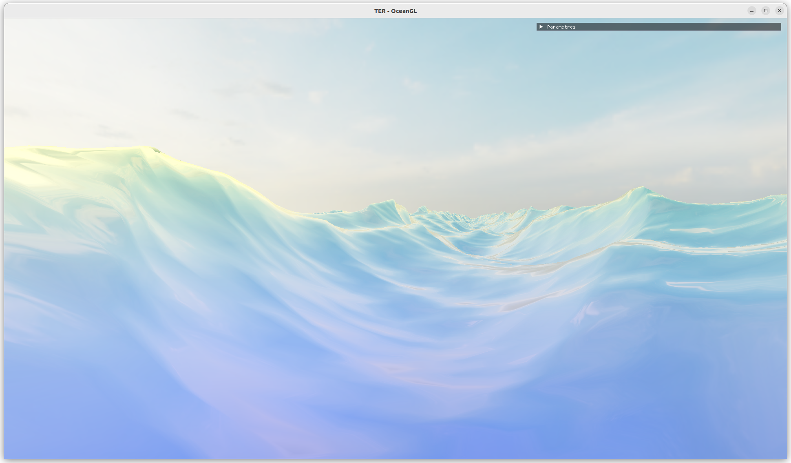
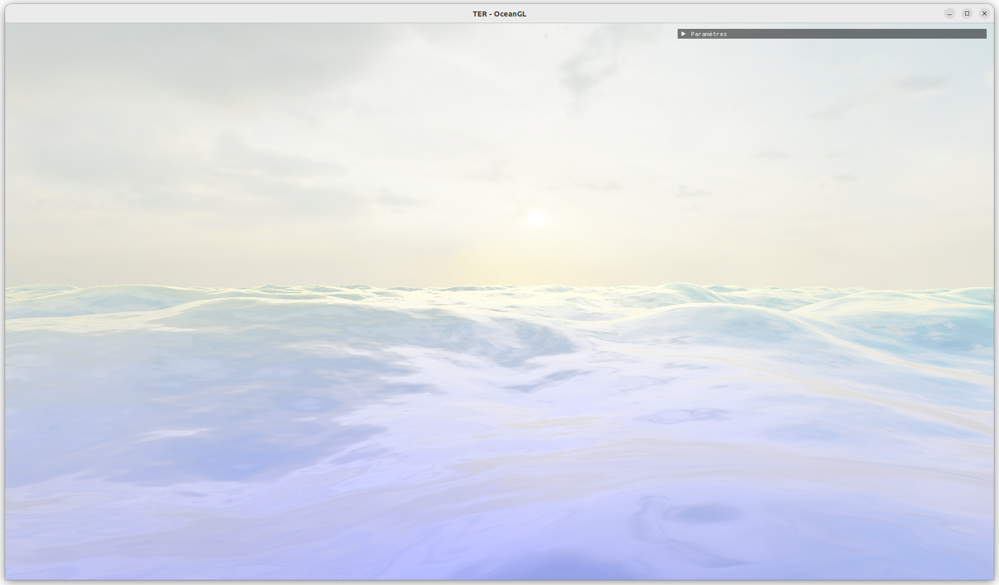

# Projet-TER-M1-IMAGINE

Projet en collaboration avec Louis Jean, Jean-Baptiste Bes et Loïc Kerbaul.

Ce TER porte sur la simulation numérique de la mer, d'une simple vague sinusoïdale en passant par les vagues de Gerstner jusqu'à la simulation par la transformée de Fourier rapide.

**Rendus:**

<figure>      <figcaption>Somme de sinusoïdes</figcaption> </figure> 

<figure>      <figcaption>Somme de sinusoïdes</figcaption> </figure> 
